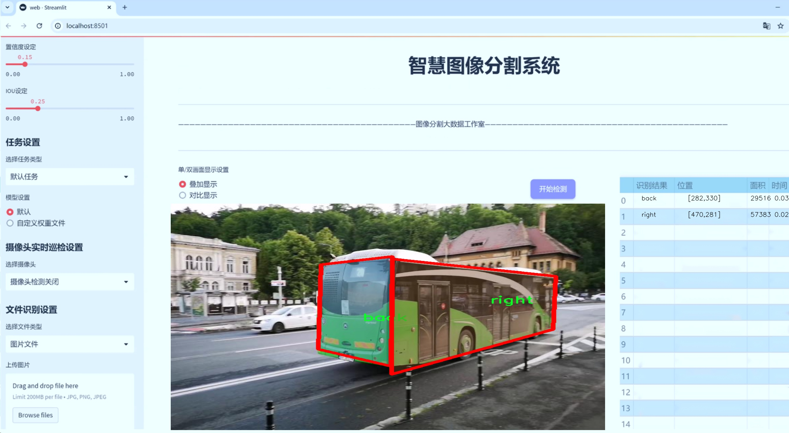
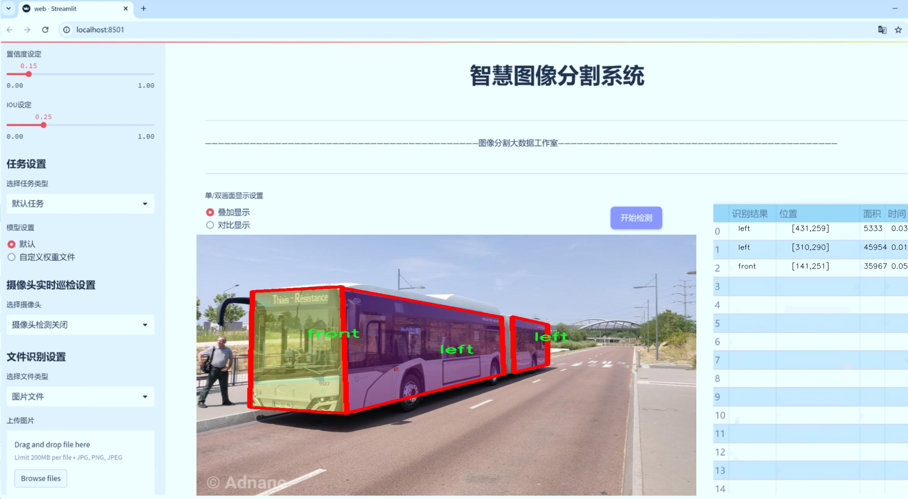
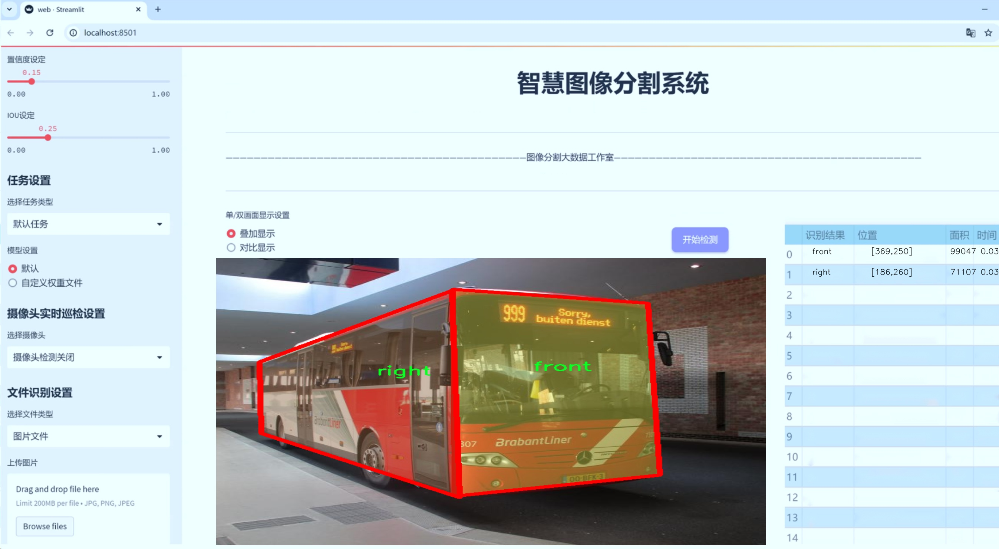
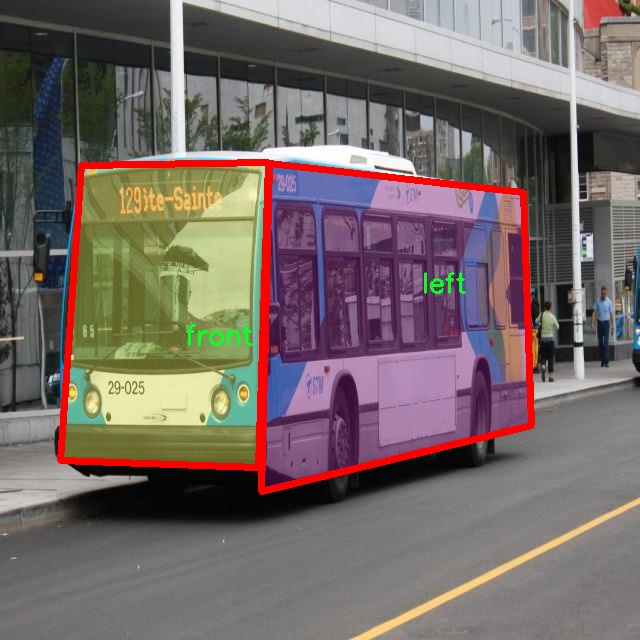
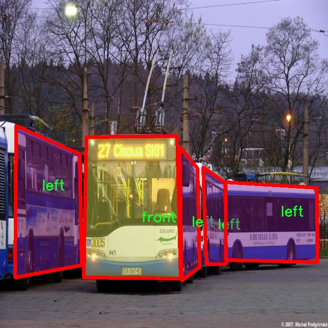
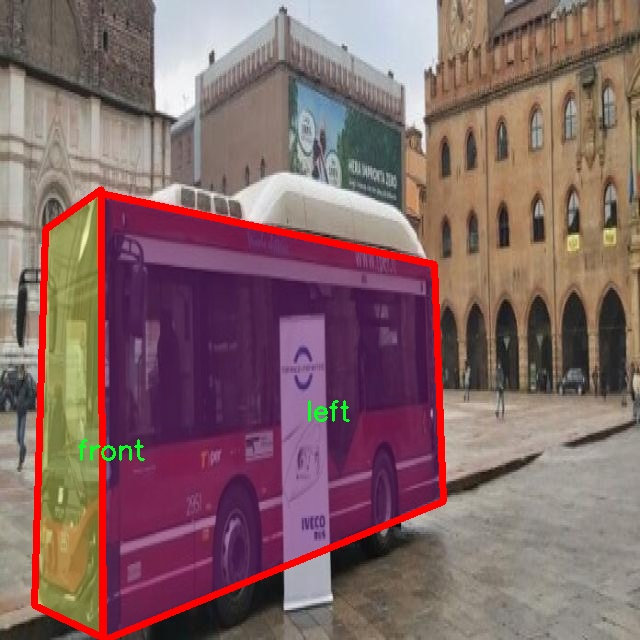
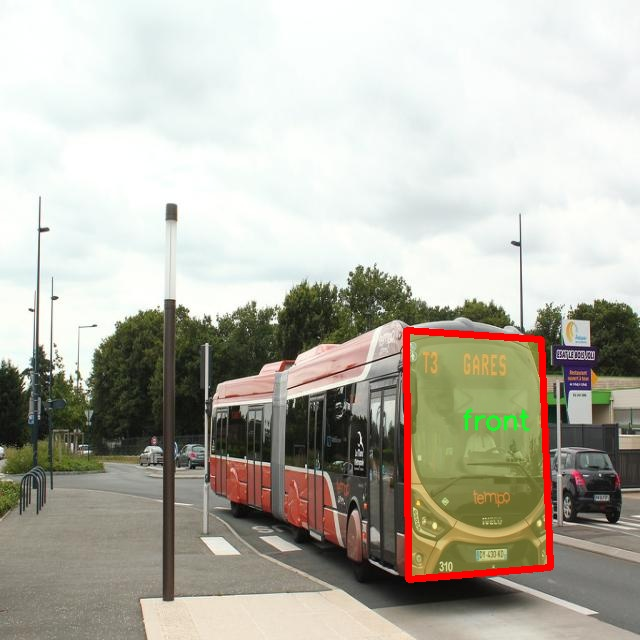
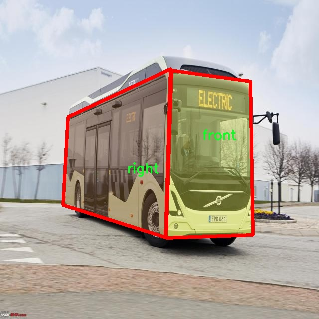

# 公交车侧面图像分割系统： yolov8-seg-FocalModulation

### 1.研究背景与意义

[参考博客](https://gitee.com/YOLOv8_YOLOv11_Segmentation_Studio/projects)

[博客来源](https://kdocs.cn/l/cszuIiCKVNis)

研究背景与意义

随着城市化进程的加快，公共交通系统的建设与管理愈发重要，尤其是公交车作为城市公共交通的主要组成部分，其运行效率和安全性直接影响到城市的交通流畅性和居民的出行体验。近年来，计算机视觉技术的快速发展为公交车的监测与管理提供了新的解决方案。特别是基于深度学习的目标检测与图像分割技术，能够有效地识别和分割图像中的不同对象，为智能交通系统的构建奠定了基础。

在此背景下，YOLO（You Only Look Once）系列模型因其高效的实时性和较好的检测精度而受到广泛关注。YOLOv8作为该系列的最新版本，进一步提升了目标检测的性能，尤其在复杂场景下的表现更为突出。然而，传统的YOLOv8模型在处理公交车侧面图像时，仍面临着分割精度不足和对不同类别的识别能力有限等问题。因此，基于改进YOLOv8的公交车侧面图像分割系统的研究具有重要的现实意义。

本研究将利用名为“BusSides”的数据集，该数据集包含1000张公交车侧面图像，涵盖了四个主要类别：后视、前视、左侧和右侧。这些类别的划分不仅有助于提升模型对公交车不同方位的识别能力，还为后续的图像分析提供了丰富的特征信息。通过对这些图像进行实例分割，研究者能够准确地提取出公交车的各个部分，从而为后续的智能监控、交通流量分析和安全管理提供支持。

此外，公交车的侧面图像分割系统在实际应用中也具有广泛的前景。通过对公交车的实时监测，交通管理部门可以及时获取公交车的运行状态，优化公交调度，提高运营效率。同时，该系统还可以为自动驾驶技术的研发提供数据支持，帮助提升自动驾驶车辆对公交车的识别和避让能力，进而增强城市交通的安全性。

综上所述，基于改进YOLOv8的公交车侧面图像分割系统的研究，不仅填补了现有技术在公交车图像处理领域的空白，还为城市公共交通的智能化管理提供了新的思路与方法。通过提升公交车侧面图像的分割精度和识别能力，研究将为构建更为高效、安全的城市交通系统贡献力量。这一研究不仅具有重要的学术价值，也为实际应用提供了切实可行的解决方案，推动了智能交通技术的发展。

### 2.图片演示







注意：本项目提供完整的训练源码数据集和训练教程,由于此博客编辑较早,暂不提供权重文件（best.pt）,需要按照6.训练教程进行训练后实现上图效果。

### 3.视频演示

[3.1 视频演示](https://www.bilibili.com/video/BV1CkBkYfEEC/)

### 4.数据集信息

##### 4.1 数据集类别数＆类别名

nc: 4
names: ['back', 'front', 'left', 'right']


##### 4.2 数据集信息简介

数据集信息展示

在现代计算机视觉领域，图像分割技术的进步为自动驾驶、智能交通等应用提供了强有力的支持。为此，我们构建了一个专门用于训练改进YOLOv8-seg的公交车侧面图像分割系统的数据集，命名为“BusSides”。该数据集的设计旨在涵盖公交车的不同侧面视角，以提高模型在实际应用中的准确性和鲁棒性。

“BusSides”数据集包含四个主要类别，分别是“back”（后侧）、“front”（前侧）、“left”（左侧）和“right”（右侧）。这些类别的选择是基于公交车在城市交通环境中可能出现的不同方位，确保模型能够有效识别和分割公交车的各个部分。每个类别的图像均经过精心挑选，确保涵盖多种场景和光照条件，以模拟真实世界中公交车的外观变化。

在数据集的构建过程中，我们收集了来自不同城市和地区的公交车图像，以增强数据的多样性和代表性。这些图像不仅包括各种型号和品牌的公交车，还涵盖了不同的天气条件、时间段和背景环境。这种多样性有助于提高模型的泛化能力，使其能够在不同的实际应用场景中表现出色。

为了确保数据集的高质量，我们对每张图像进行了详细的标注。标注过程采用了专业的图像标注工具，确保每个类别的边界框和分割区域准确无误。标注团队由经验丰富的计算机视觉专家组成，他们对公交车的结构和外观有深入的理解，从而能够提供精确的标注结果。这一过程不仅提高了数据集的质量，也为后续的模型训练奠定了坚实的基础。

在数据集的规模方面，“BusSides”包含了数千张经过标注的公交车侧面图像，足以支持深度学习模型的训练和验证。数据集的划分也经过精心设计，确保训练集、验证集和测试集的比例合理，使得模型在训练过程中能够充分学习到不同类别的特征，同时在验证和测试阶段能够有效评估模型的性能。

通过使用“BusSides”数据集，我们的目标是改进YOLOv8-seg模型在公交车侧面图像分割任务中的表现。我们相信，随着数据集的不断完善和模型的优化，未来的公交车自动识别和分割系统将能够在智能交通领域发挥更大的作用，为城市交通管理和公共交通服务提供更为高效的解决方案。

总之，“BusSides”数据集不仅是一个技术性的工具，更是推动公交车图像分割研究的重要资源。我们期待这一数据集能够为学术界和工业界的研究者提供有价值的参考，促进相关技术的进一步发展与应用。











### 5.项目依赖环境部署教程（零基础手把手教学）

[5.1 环境部署教程链接（零基础手把手教学）](https://www.bilibili.com/video/BV1jG4Ve4E9t/?vd_source=bc9aec86d164b67a7004b996143742dc)


[5.2 安装Python虚拟环境创建和依赖库安装视频教程链接（零基础手把手教学）](https://www.bilibili.com/video/BV1nA4VeYEze/?vd_source=bc9aec86d164b67a7004b996143742dc)

### 6.手把手YOLOV8-seg训练视频教程（零基础手把手教学）

[6.1 手把手YOLOV8-seg训练视频教程（零基础小白有手就能学会）](https://www.bilibili.com/video/BV1cA4VeYETe/?vd_source=bc9aec86d164b67a7004b996143742dc)


按照上面的训练视频教程链接加载项目提供的数据集，运行train.py即可开始训练



     Epoch   gpu_mem       box       obj       cls    labels  img_size
     1/200     0G   0.01576   0.01955  0.007536        22      1280: 100%|██████████| 849/849 [14:42<00:00,  1.04s/it]
               Class     Images     Labels          P          R     mAP@.5 mAP@.5:.95: 100%|██████████| 213/213 [01:14<00:00,  2.87it/s]
                 all       3395      17314      0.994      0.957      0.0957      0.0843

     Epoch   gpu_mem       box       obj       cls    labels  img_size
     2/200     0G   0.01578   0.01923  0.007006        22      1280: 100%|██████████| 849/849 [14:44<00:00,  1.04s/it]
               Class     Images     Labels          P          R     mAP@.5 mAP@.5:.95: 100%|██████████| 213/213 [01:12<00:00,  2.95it/s]
                 all       3395      17314      0.996      0.956      0.0957      0.0845

     Epoch   gpu_mem       box       obj       cls    labels  img_size
     3/200     0G   0.01561    0.0191  0.006895        27      1280: 100%|██████████| 849/849 [10:56<00:00,  1.29it/s]
               Class     Images     Labels          P          R     mAP@.5 mAP@.5:.95: 100%|███████   | 187/213 [00:52<00:00,  4.04it/s]
                 all       3395      17314      0.996      0.957      0.0957      0.0845


### 7.50+种全套YOLOV8-seg创新点加载调参实验视频教程（一键加载写好的改进模型的配置文件）

[7.1 50+种全套YOLOV8-seg创新点加载调参实验视频教程（一键加载写好的改进模型的配置文件）](https://www.bilibili.com/video/BV1Hw4VePEXv/?vd_source=bc9aec86d164b67a7004b996143742dc)

### YOLOV8-seg算法简介

原始YOLOv8-seg算法原理

YOLOv8-seg算法是YOLO系列模型中的最新版本，专注于目标检测与分割任务，继承并改进了前代模型的设计理念与技术架构。其核心原理在于通过高效的特征提取、融合与目标定位机制，实现在复杂场景下的高精度目标检测与分割。YOLOv8-seg的架构由Backbone、Neck和Head三大部分组成，结合了深度学习中的多种先进技术，形成了一种灵活且高效的处理流程。

在特征提取阶段，YOLOv8-seg采用了CSPDarknet作为Backbone，这一结构通过将网络分为两个部分并引入多个残差块，显著提升了特征提取的能力。与YOLOv5相比，YOLOv8-seg引入了C2f模块替代了C3模块，C2f模块通过将输入特征图分为两个分支并分别进行卷积处理，从而增强了特征图的维度和丰富性。这种设计不仅提高了模型的梯度流信息，还通过更深层次的特征融合，提升了模型对复杂目标的识别能力。

YOLOv8-seg还引入了快速空间金字塔池化（SPPF）结构，旨在有效提取不同尺度的特征。这一特征金字塔网络的设计使得模型在处理多尺度目标时能够保持高效性，减少了参数量和计算量，同时提升了特征提取的效率。通过这些创新，YOLOv8-seg能够在保持高检测精度的同时，提升模型的响应速度。

在Neck部分，YOLOv8-seg采用了特征金字塔网络（FPN）与路径聚合网络（PAN）的结合结构。此结构通过多层卷积和池化操作，对特征图进行深度融合，确保了不同层次特征的有效传递。通过自下而上的特征融合，YOLOv8-seg能够将高层特征与中层和浅层特征相结合，从而增强了模型对目标的语义理解能力。这样的设计使得模型在面对复杂背景时，能够更好地分辨出目标与背景之间的细微差别。

在目标检测阶段，YOLOv8-seg采用了一种无锚框（Anchor-Free）的检测方式。这一创新使得模型不再依赖于预定义的锚框，而是直接预测目标的中心点及其宽高比例。这种方法不仅简化了模型的设计，还提高了检测速度和准确度，尤其在处理小目标或密集目标时，表现尤为突出。YOLOv8-seg通过解耦分类与回归的方式，使得模型在目标定位与分类任务中能够独立优化，从而进一步提升了检测精度。

YOLOv8-seg的损失函数设计也展现了其在处理复杂场景时的优势。采用VFLLoss作为分类损失，并结合DFLLoss与CIoULoss进行边框回归，确保了模型在面对样本不平衡和困难样本时，能够有效调整学习策略。通过这种多样化的损失函数设计，YOLOv8-seg在训练过程中能够更好地应对各种挑战，提高了整体的收敛速度和检测精度。

此外，YOLOv8-seg在数据预处理方面也进行了创新，采用了包括马赛克增强、混合增强、空间扰动及颜色扰动等多种增强手段。这些预处理技术的引入，不仅丰富了训练样本的多样性，还有效提升了模型的泛化能力，使其在实际应用中能够更好地适应不同的场景与条件。

综上所述，YOLOv8-seg算法通过引入先进的网络结构与创新的特征处理机制，形成了一种高效的目标检测与分割解决方案。其在特征提取、特征融合、目标定位及损失函数设计等多个方面的改进，使得YOLOv8-seg在复杂场景下的目标检测与分割任务中展现出了优异的性能。这些技术的结合，不仅提升了模型的准确性与速度，也为后续的研究与应用提供了新的思路与方向。随着YOLOv8-seg的不断发展与完善，未来在智能监控、自动驾驶、医学影像等领域的应用前景将更加广阔。


### 9.系统功能展示（检测对象为举例，实际内容以本项目数据集为准）

图9.1.系统支持检测结果表格显示

  图9.2.系统支持置信度和IOU阈值手动调节

  图9.3.系统支持自定义加载权重文件best.pt(需要你通过步骤5中训练获得)

  图9.4.系统支持摄像头实时识别

  图9.5.系统支持图片识别

  图9.6.系统支持视频识别

  图9.7.系统支持识别结果文件自动保存

  图9.8.系统支持Excel导出检测结果数据


### 10.50+种全套YOLOV8-seg创新点原理讲解（非科班也可以轻松写刊发刊，V11版本正在科研待更新）

#### 10.1 由于篇幅限制，每个创新点的具体原理讲解就不一一展开，具体见下列网址中的创新点对应子项目的技术原理博客网址【Blog】：


[10.1 50+种全套YOLOV8-seg创新点原理讲解链接](https://gitee.com/qunmasj/good)

#### 10.2 部分改进模块原理讲解(完整的改进原理见上图和技术博客链接)【如果此小节的图加载失败可以通过CSDN或者Github搜索该博客的标题访问原始博客，原始博客图片显示正常】

### YOLOv8简介


由上图可以看出，C2中每个BottlNeck的输入Tensor的通道数channel都只是上一级的0.5倍，因此计算量明显降低。从另一方面讲，梯度流的增加，t也能够明显提升收敛速度和收敛效果。
C2i模块首先以输入tensor(n.c.h.w)经过Conv1层进行split拆分，分成两部分(n,0.5c,h,w)，一部分直接经过n个Bottlenck，另一部分经过每一操作层后都会以(n.0.5c,h,w)的尺寸进行Shortcut，最后通过Conv2层卷积输出。也就是对应n+2的Shortcut(第一层Conv1的分支tensor和split后的tensor为2+n个bottenlenneck)。
#### Neck
YOLOv8的Neck采用了PANet结构，如下图所示。

Backbone最后SPPF模块(Layer9)之后H、W经过32倍下采样，对应地Layer4经过8倍下采样，Layer6经过16倍下采样。输入图片分辨率为640*640，得到Layer4、Layer6、Layer9的分辨率分别为80*80、40*40和20*20。
Layer4、Layer6、Layer9作为PANet结构的输入，经过上采样，通道融合，最终将PANet的三个输出分支送入到Detect head中进行Loss的计算或结果解算。
与FPN(单向，自上而下)不同的是，PANet是一个双向通路网络，引入了自下向上的路径，使得底层信息更容易传递到顶层。
#### Head
Head部分相比Yolov5改动较大，直接将耦合头改为类似Yolo的解耦头结构(Decoupled-Head)，将回归分支和预测分支分离，并针对回归分支使用了Distribution Focal Loss策略中提出的积分形式表示法。之前的目标检测网络将回归坐标作为一个确定性单值进行预测，DFL将坐标转变成一个分布。


### LSKNet的架构
该博客提出的结构层级依次为：

LSK module（大核卷积序列+空间选择机制） < LSK Block （LK Selection + FFN）<LSKNet（N个LSK Block）


#### LSK 模块

LSK Block
LSKNet 是主干网络中的一个可重复堆叠的块（Block），每个LSK Block包括两个残差子块，即大核选择子块（Large Kernel Selection，LK Selection）和前馈网络子块（Feed-forward Network ，FFN），如图8。LK Selection子块根据需要动态地调整网络的感受野，FFN子块用于通道混合和特征细化，由一个全连接层、一个深度卷积、一个 GELU 激活和第二个全连接层组成。

LSK module（LSK 模块，图4）由一个大核卷积序列（large kernel convolutions）和一个空间核选择机制（spatial kernel selection mechanism）组成，被嵌入到了LSK Block 的 LK Selection子块中。

#### Large Kernel Convolutions
因为不同类型的目标对背景信息的需求不同，这就需要模型能够自适应选择不同大小的背景范围。因此，作者通过解耦出一系列具有大卷积核、且不断扩张的Depth-wise 卷积，构建了一个更大感受野的网络。

具体地，假设序列中第i个Depth-wise 卷积核的大小为 ，扩张率为 d，感受野为 ，它们满足以下关系：


卷积核大小和扩张率的增加保证了感受野能够快速增大。此外，我们设置了扩张率的上限，以保证扩张卷积不会引入特征图之间的差距。


Table2的卷积核大小可根据公式（1）和（2）计算，详见下图：


这样设计的好处有两点。首先，能够产生具有多种不同大小感受野的特征，便于后续的核选择；第二，序列解耦比简单的使用一个大型卷积核效果更好。如上图表2所示，解耦操作相对于标准的大型卷积核，有效地将低了模型的参数量。

为了从输入数据  的不同区域获取丰富的背景信息特征，可采用一系列解耦的、不用感受野的Depth-wise 卷积核：


其中，是卷积核为 、扩张率为  的Depth-wise 卷积操作。假设有个解耦的卷积核，每个卷积操作后又要经过一个的卷积层进行空间特征向量的通道融合。


之后，针对不同的目标，可基于获取的多尺度特征，通过下文中的选择机制动态选择合适的卷积核大小。

这一段的意思可以简单理解为：

把一个大的卷积核拆成了几个小的卷积核，比如一个大小为5，扩张率为1的卷积核加上一个大小为7，扩张率为3的卷积核，感受野为23，与一个大小为23，扩张率为1的卷积核的感受野是一样的。因此可用两个小的卷积核替代一个大的卷积核，同理一个大小为29的卷积核也可以用三个小的卷积代替（Table 2），这样可以有效的减少参数，且更灵活。

将输入数据依次通过这些小的卷积核（公式3），并在每个小的卷积核后面接上一个1×1的卷积进行通道融合（公式4）。

#### Spatial Kernel Selection
为了使模型更关注目标在空间上的重点背景信息，作者使用空间选择机制从不同尺度的大卷积核中对特征图进行空间选择。

首先，将来自于不同感受野卷积核的特征进行concate拼接，然后，应用通道级的平均池化和最大池化提取空间关系，其中， 和  是平均池化和最大池化后的空间特征描述符。为了实现不同空间描述符的信息交互，作者利用卷积层将空间池化特征进行拼接，将2个通道的池化特征转换为N个空间注意力特征图，之后，将Sigmoid激活函数应用到每一个空间注意力特征图，可获得每个解耦的大卷积核所对应的独立的空间选择掩膜，又然后，将解耦后的大卷积核序列的特征与对应的空间选择掩膜进行加权处理，并通过卷积层进行融合获得注意力特征 ，最后LSK module的输出可通过输入特征  与注意力特征  的逐元素点成获得，公式对应于结构图上的操作如下：


### 11.项目核心源码讲解（再也不用担心看不懂代码逻辑）

#### 11.1 ultralytics\nn\extra_modules\ops_dcnv3\modules\dcnv3.py

以下是对代码中最核心部分的提取和详细中文注释：

```python
import torch
from torch import nn
import torch.nn.functional as F
from torch.nn.init import xavier_uniform_, constant_

class DCNv3(nn.Module):
    def __init__(self, channels=64, kernel_size=3, stride=1, pad=1, dilation=1, group=4, offset_scale=1.0, center_feature_scale=False, remove_center=False):
        """
        DCNv3模块的初始化
        :param channels: 输入和输出的通道数
        :param kernel_size: 卷积核的大小
        :param stride: 卷积的步幅
        :param pad: 卷积的填充
        :param dilation: 卷积的扩张
        :param group: 分组卷积的组数
        :param offset_scale: 偏移量的缩放因子
        :param center_feature_scale: 是否使用中心特征缩放
        :param remove_center: 是否移除中心点
        """
        super().__init__()
        if channels % group != 0:
            raise ValueError(f'channels must be divisible by group, but got {channels} and {group}')
        
        self.channels = channels
        self.kernel_size = kernel_size
        self.stride = stride
        self.dilation = dilation
        self.pad = pad
        self.group = group
        self.group_channels = channels // group
        self.offset_scale = offset_scale
        self.center_feature_scale = center_feature_scale
        self.remove_center = int(remove_center)

        # 定义偏移量和掩码的线性层
        self.offset = nn.Linear(channels, group * (kernel_size * kernel_size - remove_center) * 2)
        self.mask = nn.Linear(channels, group * (kernel_size * kernel_size - remove_center))
        self.input_proj = nn.Linear(channels, channels)  # 输入投影
        self.output_proj = nn.Linear(channels, channels)  # 输出投影
        self._reset_parameters()  # 初始化参数

        if center_feature_scale:
            self.center_feature_scale_proj_weight = nn.Parameter(torch.zeros((group, channels), dtype=torch.float))
            self.center_feature_scale_proj_bias = nn.Parameter(torch.tensor(0.0, dtype=torch.float).view((1,)).repeat(group, ))

    def _reset_parameters(self):
        """重置模型参数"""
        constant_(self.offset.weight.data, 0.)
        constant_(self.offset.bias.data, 0.)
        constant_(self.mask.weight.data, 0.)
        constant_(self.mask.bias.data, 0.)
        xavier_uniform_(self.input_proj.weight.data)
        constant_(self.input_proj.bias.data, 0.)
        xavier_uniform_(self.output_proj.weight.data)
        constant_(self.output_proj.bias.data, 0.)

    def forward(self, input):
        """
        前向传播
        :param input: 输入张量 (N, H, W, C)
        :return: 输出张量 (N, H, W, C)
        """
        N, H, W, _ = input.shape  # 获取输入的形状

        x = self.input_proj(input)  # 输入投影
        x_proj = x  # 保存输入投影的副本

        x1 = input.permute(0, 3, 1, 2)  # 将输入张量从 (N, H, W, C) 转换为 (N, C, H, W)
        x1 = self.dw_conv(x1).permute(0, 2, 3, 1)  # 深度卷积并恢复维度

        offset = self.offset(x1)  # 计算偏移量
        mask = self.mask(x1).reshape(N, H, W, self.group, -1)  # 计算掩码并调整形状
        mask = F.softmax(mask, -1)  # 对掩码进行softmax归一化

        # 使用DCNv3的核心函数进行卷积操作
        x = DCNv3Function.apply(
            x, offset, mask,
            self.kernel_size, self.kernel_size,
            self.stride, self.stride,
            self.pad, self.pad,
            self.dilation, self.dilation,
            self.group, self.group_channels,
            self.offset_scale,
            256,
            self.remove_center)

        # 如果启用中心特征缩放
        if self.center_feature_scale:
            center_feature_scale = self.center_feature_scale_module(x1, self.center_feature_scale_proj_weight, self.center_feature_scale_proj_bias)
            center_feature_scale = center_feature_scale[..., None].repeat(1, 1, 1, 1, self.channels // self.group).flatten(-2)
            x = x * (1 - center_feature_scale) + x_proj * center_feature_scale  # 结合输入和输出

        x = self.output_proj(x)  # 输出投影
        return x  # 返回输出
```

### 代码核心部分说明：
1. **DCNv3类**：实现了深度可分离卷积的主要逻辑，初始化参数并定义前向传播过程。
2. **参数初始化**：使用`_reset_parameters`方法初始化模型参数，确保偏移量和掩码的权重为零。
3. **前向传播**：处理输入数据，计算偏移量和掩码，使用自定义的`DCNv3Function`进行卷积操作，并根据需要进行中心特征缩放。

### 注意事项：
- 该代码实现了深度可分离卷积（DCNv3），适用于图像处理和计算机视觉任务。
- 需要确保输入数据的形状和参数设置符合要求。

这个文件 `dcnv3.py` 实现了一个名为 DCNv3 的深度学习模块，主要用于计算机视觉任务中的卷积操作。该模块的设计基于动态卷积（Dynamic Convolution）和特征尺度调整，旨在提高模型的灵活性和性能。

首先，文件中引入了一些必要的库，包括 PyTorch 的核心库和一些函数。接着定义了两个类 `to_channels_first` 和 `to_channels_last`，它们的作用是调整输入张量的通道维度顺序，以便于在不同的格式（通道优先或通道最后）之间转换。

接下来，定义了 `build_norm_layer` 和 `build_act_layer` 函数，用于构建归一化层和激活层。`build_norm_layer` 根据输入格式和输出格式选择合适的归一化方法（如批归一化或层归一化），而 `build_act_layer` 则根据指定的激活函数类型（如 ReLU、SiLU 或 GELU）返回相应的激活层。

`_is_power_of_2` 函数用于检查一个数是否是 2 的幂，这在后续的模块设计中是一个重要的性能考量。

`CenterFeatureScaleModule` 类用于计算中心特征尺度，通过线性变换并应用 Sigmoid 激活函数来生成尺度因子。

`DCNv3_pytorch` 类是 DCNv3 模块的核心实现。构造函数中定义了多个参数，包括通道数、卷积核大小、步幅、填充、扩张、分组数等。它还包括动态卷积所需的偏移量和掩码的线性层。该模块在前向传播中，首先通过输入投影层对输入进行线性变换，然后进行深度卷积和动态卷积的计算，最后通过输出投影层生成最终输出。

`DCNv3` 类是对 `DCNv3_pytorch` 的封装，提供了类似的功能，但使用了不同的卷积实现（`Conv` 类）。它的前向传播方法与 `DCNv3_pytorch` 类似，处理输入并生成输出。

最后，`DCNv3_DyHead` 类是 DCNv3 模块的一个变体，主要用于动态头部的实现。它在前向传播中直接使用了 DCNv3 的功能，处理偏移量和掩码，最终输出结果。

整体而言，这个文件实现了一个灵活且高效的动态卷积模块，适用于各种计算机视觉任务，特别是在需要动态调整卷积操作的场景中。通过对输入特征的细致处理和动态调整，DCNv3 模块能够有效提升模型的表现。

#### 11.2 ultralytics\utils\benchmarks.py

以下是代码中最核心的部分，并附上详细的中文注释：

```python
import time
import numpy as np
import pandas as pd
from ultralytics import YOLO
from ultralytics.utils import select_device, check_requirements, check_yolo, file_size, LOGGER

def benchmark(model='yolov8n.pt', imgsz=160, half=False, int8=False, device='cpu', verbose=False):
    """
    基准测试YOLO模型在不同格式下的速度和准确性。

    参数:
        model (str): 模型文件的路径，默认为'yolov8n.pt'。
        imgsz (int): 用于基准测试的图像大小，默认为160。
        half (bool): 是否使用半精度模型，默认为False。
        int8 (bool): 是否使用int8精度模型，默认为False。
        device (str): 运行基准测试的设备，可以是'cpu'或'cuda'，默认为'cpu'。
        verbose (bool): 如果为True，将在基准测试失败时断言，默认为False。

    返回:
        df (pandas.DataFrame): 包含每种格式的基准测试结果的DataFrame，包括文件大小、指标和推理时间。
    """
    
    # 设置Pandas显示选项
    pd.options.display.max_columns = 10
    pd.options.display.width = 120
    
    # 选择设备
    device = select_device(device, verbose=False)
    
    # 加载模型
    model = YOLO(model) if isinstance(model, (str, Path)) else model

    results = []  # 存储结果
    start_time = time.time()  # 记录开始时间
    
    # 遍历不同的导出格式
    for i, (name, format, suffix, cpu, gpu) in export_formats().iterrows():
        emoji, filename = '❌', None  # 默认导出状态为失败
        try:
            # 确保导出格式的兼容性
            if 'cpu' in device.type:
                assert cpu, 'CPU不支持推理'
            if 'cuda' in device.type:
                assert gpu, 'GPU不支持推理'

            # 导出模型
            filename = model.export(imgsz=imgsz, format=format, half=half, int8=int8, device=device, verbose=False)
            exported_model = YOLO(filename, task=model.task)  # 加载导出的模型
            emoji = '✅'  # 导出成功

            # 进行推理
            exported_model.predict('path/to/sample/image.jpg', imgsz=imgsz, device=device, half=half)

            # 验证模型
            results_dict = exported_model.val(data='path/to/dataset.yaml', batch=1, imgsz=imgsz, device=device, half=half, int8=int8, verbose=False)
            metric, speed = results_dict.results_dict['mAP'], results_dict.speed['inference']
            results.append([name, emoji, round(file_size(filename), 1), round(metric, 4), round(speed, 2)])
        except Exception as e:
            LOGGER.warning(f'基准测试失败: {name}: {e}')
            results.append([name, emoji, round(file_size(filename), 1), None, None])  # 记录失败信息

    # 打印结果
    check_yolo(device=device)  # 打印系统信息
    df = pd.DataFrame(results, columns=['格式', '状态', '大小 (MB)', '指标', '推理时间 (ms/im)'])

    # 输出基准测试完成的信息
    LOGGER.info(f'基准测试完成，耗时: {time.time() - start_time:.2f}s\n{df}\n')
    return df
```

### 代码核心部分说明：
1. **导入必要的库**：导入了时间、NumPy、Pandas等库，以及YOLO模型和一些工具函数。
2. **benchmark函数**：这是进行模型基准测试的主要函数，接受多个参数来配置测试。
3. **设备选择**：使用`select_device`函数选择运行基准测试的设备（CPU或GPU）。
4. **模型加载**：根据传入的模型路径加载YOLO模型。
5. **导出格式遍历**：遍历不同的模型导出格式，进行模型导出、推理和验证。
6. **异常处理**：在导出和推理过程中，捕获异常并记录失败信息。
7. **结果输出**：将测试结果存储在DataFrame中，并打印基准测试的完成信息。

### 注意事项：
- 在实际使用中，需要确保路径和文件名正确，并根据需要调整图像路径和数据集路径。
- 代码中使用的`export_formats`、`file_size`等函数和变量需要在上下文中定义或导入。

这个程序文件 `benchmarks.py` 是 Ultralytics YOLO（目标检测模型）的一部分，主要用于对不同格式的 YOLO 模型进行性能基准测试，包括速度和准确性。文件中包含了两个主要的类和多个函数，下面是对其功能的详细说明。

首先，文件的开头部分包含了使用说明，用户可以通过导入 `ProfileModels` 和 `benchmark` 函数来进行模型的基准测试。可以通过指定模型的配置文件（如 `yolov8n.yaml`）和模型权重文件（如 `yolov8n.pt`）来进行测试。支持的模型格式包括 PyTorch、ONNX、TensorRT 等。

`benchmark` 函数是文件的核心功能之一。它的主要作用是对指定的 YOLO 模型进行基准测试。函数接受多个参数，包括模型路径、数据集、图像大小、是否使用半精度或 INT8 精度、设备类型（CPU 或 CUDA）以及是否输出详细信息。该函数会根据不同的格式导出模型，并对每种格式进行推理和验证，最后返回一个包含基准测试结果的 pandas DataFrame。

在基准测试过程中，函数会遍历所有支持的模型格式，进行模型导出、推理和验证。每种格式的结果会被记录，包括文件大小、性能指标（如 mAP）和推理时间。如果测试失败，会记录错误信息并在日志中输出。最终，基准测试的结果会被打印并写入日志文件。

`ProfileModels` 类则用于对不同模型进行性能分析，特别是 ONNX 和 TensorRT 格式的模型。该类初始化时接受模型路径、定时运行次数、预热运行次数、最小运行时间、图像大小等参数。它的 `profile` 方法会获取指定路径下的模型文件，执行基准测试并打印结果。

在 `ProfileModels` 类中，还定义了一些辅助方法，例如 `get_files` 用于获取模型文件，`get_onnx_model_info` 用于获取 ONNX 模型的信息，`profile_tensorrt_model` 和 `profile_onnx_model` 分别用于对 TensorRT 和 ONNX 模型进行性能分析。这些方法通过多次运行模型并计算平均运行时间和标准差来评估模型的性能。

最后，文件中还包含了一些用于格式化输出的辅助函数，例如 `generate_table_row` 和 `print_table`，用于生成和打印模型性能的比较表格。

总体而言，这个文件为 YOLO 模型的性能评估提供了全面的工具，用户可以通过简单的接口快速获取不同模型格式的速度和准确性指标。

#### 11.3 ultralytics\utils\__init__.py

以下是经过简化并注释的核心代码部分：

```python
import os
import platform
import logging
from pathlib import Path
import torch
import yaml

# 设置 PyTorch 打印选项
torch.set_printoptions(linewidth=320, precision=4, profile='default')

# 定义一些常量
ROOT = Path(__file__).resolve().parents[1]  # 获取当前文件的父目录，即项目根目录
DEFAULT_CFG_PATH = ROOT / 'cfg/default.yaml'  # 默认配置文件路径

# 设置日志记录
def set_logging(name='ultralytics', verbose=True):
    """设置日志记录的配置"""
    level = logging.INFO if verbose else logging.ERROR  # 根据是否详细模式设置日志级别
    logging.basicConfig(level=level, format='%(message)s')  # 配置日志格式

# 加载 YAML 配置文件
def yaml_load(file='data.yaml'):
    """从 YAML 文件加载数据"""
    with open(file, 'r', encoding='utf-8') as f:
        return yaml.safe_load(f)  # 使用安全加载，避免执行任意代码

# 保存 YAML 数据到文件
def yaml_save(file='data.yaml', data=None):
    """将数据保存为 YAML 格式"""
    with open(file, 'w', encoding='utf-8') as f:
        yaml.safe_dump(data, f, sort_keys=False, allow_unicode=True)  # 保存数据，允许 Unicode

# 检查当前操作系统是否为 Ubuntu
def is_ubuntu() -> bool:
    """检查操作系统是否为 Ubuntu"""
    return platform.system() == 'Linux' and 'ubuntu' in platform.version().lower()

# 获取用户配置目录
def get_user_config_dir(sub_dir='Ultralytics'):
    """获取用户配置目录"""
    if platform.system() == 'Windows':
        path = Path.home() / 'AppData' / 'Roaming' / sub_dir
    elif platform.system() == 'Darwin':  # macOS
        path = Path.home() / 'Library' / 'Application Support' / sub_dir
    else:  # Linux
        path = Path.home() / '.config' / sub_dir

    path.mkdir(parents=True, exist_ok=True)  # 创建目录（如果不存在）
    return path

# 设置全局变量
USER_CONFIG_DIR = get_user_config_dir()  # 获取用户配置目录
SETTINGS_YAML = USER_CONFIG_DIR / 'settings.yaml'  # 设置 YAML 文件路径
set_logging()  # 初始化日志记录

# 加载默认配置
DEFAULT_CFG_DICT = yaml_load(DEFAULT_CFG_PATH)  # 从默认配置文件加载配置
```

### 代码注释说明：
1. **导入模块**：导入必要的库，包括操作系统、平台、日志记录、路径处理、PyTorch 和 YAML 处理。
2. **设置 PyTorch 打印选项**：配置 PyTorch 的打印格式，以便在输出时更易读。
3. **定义常量**：定义项目根目录和默认配置文件路径。
4. **日志记录设置**：定义 `set_logging` 函数来配置日志记录的格式和级别。
5. **YAML 加载和保存**：定义 `yaml_load` 和 `yaml_save` 函数，用于从 YAML 文件加载数据和将数据保存为 YAML 格式。
6. **操作系统检查**：定义 `is_ubuntu` 函数来检查当前操作系统是否为 Ubuntu。
7. **用户配置目录**：定义 `get_user_config_dir` 函数来获取用户配置目录，并在必要时创建该目录。
8. **全局变量设置**：获取用户配置目录并设置 YAML 文件路径，最后初始化日志记录。

这个文件是Ultralytics YOLO（You Only Look Once）项目的一个工具模块，主要用于初始化和配置一些通用的功能和设置。文件开头导入了许多必要的库，包括标准库和第三方库，如`torch`、`cv2`、`yaml`等。

文件中定义了一些常量和全局变量，例如获取当前操作系统的信息、设置多线程的数量、配置默认的路径等。`AUTOINSTALL`和`VERBOSE`变量用于控制自动安装和详细输出模式的开关。`HELP_MSG`字符串提供了YOLOv8的使用示例，包括如何安装、使用Python SDK和命令行接口。

接下来，文件定义了一些类和函数。`TQDM`类是对`tqdm`库的一个自定义封装，用于显示进度条。`SimpleClass`和`IterableSimpleNamespace`类提供了便于调试和使用的基础类，允许更方便地访问和表示对象的属性。

`plt_settings`函数是一个装饰器，用于临时设置`matplotlib`的参数和后端。`set_logging`函数用于配置日志记录，`emojis`函数则确保在Windows平台上日志消息中的表情符号能够正确显示。

文件还定义了一些与线程安全、YAML文件读写相关的函数，例如`yaml_save`和`yaml_load`，用于保存和加载YAML格式的数据。`yaml_print`函数则用于以美观的格式打印YAML文件或字典。

此外，文件中还包含了一些检查当前运行环境的函数，如`is_ubuntu`、`is_colab`、`is_kaggle`等，用于判断代码是否在特定环境中运行。这些函数返回布尔值，指示当前环境的类型。

文件的后半部分包含了一些与Git相关的功能，例如获取Git目录、获取Git分支名等。`get_default_args`函数用于获取函数的默认参数。还有一些与用户配置、颜色处理和异常处理相关的功能。

最后，文件通过一系列初始化步骤设置了默认配置、数据集目录、权重目录等，并在必要时应用了补丁。这些步骤确保了在使用YOLO模型时，环境和配置是正确的，从而避免潜在的错误。整体来看，这个文件为YOLO项目提供了基础的工具和配置支持，确保用户能够顺利使用该框架进行目标检测等任务。

#### 11.4 ultralytics\cfg\__init__.py

以下是经过简化并添加详细中文注释的核心代码部分：

```python
import sys
from pathlib import Path
from ultralytics.utils import LOGGER, DEFAULT_CFG_DICT, checks, yaml_load, yaml_print

# 定义有效的任务和模式
MODES = 'train', 'val', 'predict', 'export', 'track', 'benchmark'
TASKS = 'detect', 'segment', 'classify', 'pose'

# 任务与数据集、模型、评估指标的映射
TASK2DATA = {
    'detect': 'coco8.yaml',
    'segment': 'coco8-seg.yaml',
    'classify': 'imagenet10',
    'pose': 'coco8-pose.yaml'
}
TASK2MODEL = {
    'detect': 'yolov8n.pt',
    'segment': 'yolov8n-seg.pt',
    'classify': 'yolov8n-cls.pt',
    'pose': 'yolov8n-pose.pt'
}

def cfg2dict(cfg):
    """
    将配置对象转换为字典格式，支持文件路径、字符串或SimpleNamespace对象。

    参数:
        cfg (str | Path | dict | SimpleNamespace): 要转换的配置对象。

    返回:
        cfg (dict): 转换后的字典格式配置对象。
    """
    if isinstance(cfg, (str, Path)):
        cfg = yaml_load(cfg)  # 从文件加载字典
    elif isinstance(cfg, SimpleNamespace):
        cfg = vars(cfg)  # 转换为字典
    return cfg

def get_cfg(cfg=DEFAULT_CFG_DICT, overrides=None):
    """
    加载并合并配置数据。

    参数:
        cfg (str | Path | Dict | SimpleNamespace): 配置数据。
        overrides (Dict | optional): 覆盖配置的字典。

    返回:
        (SimpleNamespace): 训练参数的命名空间。
    """
    cfg = cfg2dict(cfg)  # 转换配置为字典

    # 合并覆盖配置
    if overrides:
        overrides = cfg2dict(overrides)
        cfg = {**cfg, **overrides}  # 合并字典，优先使用覆盖配置

    # 返回命名空间
    return SimpleNamespace(**cfg)

def entrypoint(debug=''):
    """
    入口函数，负责解析传递给包的命令行参数。

    参数:
        debug (str): 调试信息，默认为空。
    """
    args = (debug.split(' ') if debug else sys.argv)[1:]  # 获取命令行参数
    if not args:  # 如果没有参数
        LOGGER.info("请提供有效的参数。")
        return

    overrides = {}  # 存储覆盖的参数
    for a in args:
        if '=' in a:
            k, v = a.split('=', 1)  # 分割参数
            overrides[k] = v  # 存储覆盖参数
        elif a in TASKS:
            overrides['task'] = a  # 识别任务
        elif a in MODES:
            overrides['mode'] = a  # 识别模式

    # 检查模式和任务的有效性
    mode = overrides.get('mode', 'predict')  # 默认模式为预测
    task = overrides.get('task')

    if task and task not in TASKS:
        raise ValueError(f"无效的任务: {task}，有效任务为: {TASKS}")

    # 运行指定模式的模型
    model = TASK2MODEL.get(task, 'yolov8n.pt')  # 获取模型
    LOGGER.info(f"使用模型: {model} 进行 {mode} 操作")
    # 这里可以调用模型的相应方法，例如 model.predict() 等

if __name__ == '__main__':
    entrypoint()  # 调用入口函数
```

### 代码说明：
1. **导入模块**：导入必要的模块和工具函数。
2. **定义常量**：定义有效的任务和模式，以及任务与数据集、模型、评估指标的映射。
3. **cfg2dict**：将配置对象转换为字典格式的函数，支持多种输入类型。
4. **get_cfg**：加载并合并配置数据的函数，返回一个命名空间对象。
5. **entrypoint**：程序的入口函数，解析命令行参数并根据任务和模式执行相应的操作。
6. **主程序**：在脚本直接运行时调用入口函数。 

通过这些核心部分，程序能够解析用户输入的命令行参数，并根据指定的任务和模式执行相应的YOLO模型操作。

这个程序文件是Ultralytics YOLO的一个初始化模块，主要用于处理YOLO模型的配置和命令行接口。首先，它导入了一些必要的库和模块，包括路径处理、类型检查和日志记录等。接着，定义了一些有效的任务和模式，例如训练、验证、预测等，以及每种任务对应的数据集和模型文件。

文件中包含了一个帮助信息字符串，提供了关于如何使用YOLO命令的说明，包括可用的任务、模式和参数示例。这些信息对于用户理解如何使用命令行工具非常重要。

接下来，定义了一些用于配置检查的键，例如浮点数、整数和布尔值的键，以确保用户输入的配置参数类型正确。`cfg2dict`函数用于将配置对象转换为字典格式，以便后续处理。`get_cfg`函数则负责加载和合并配置数据，支持从文件、字典或其他对象中获取配置，并进行类型和数值的检查。

`get_save_dir`函数用于生成保存目录的路径，确保在训练或验证过程中保存模型和结果。`_handle_deprecation`函数处理过时的配置键，提醒用户使用新的配置项。

`check_dict_alignment`函数用于检查自定义配置与基础配置之间的键是否匹配，如果发现不匹配的键，会提供相似的键作为提示。`merge_equals_args`函数则处理命令行参数，合并孤立的等号参数。

文件还包含了处理Ultralytics HUB和YOLO设置的函数，允许用户通过命令行进行登录、登出和设置重置等操作。`parse_key_value_pair`和`smart_value`函数用于解析和转换命令行参数的键值对。

`entrypoint`函数是该模块的入口点，负责解析传递给程序的命令行参数，并根据这些参数执行相应的任务。它处理了任务和模式的选择，检查参数的有效性，并最终调用相应的模型方法进行训练、预测等操作。

最后，文件中还定义了一个特殊模式的函数`copy_default_cfg`，用于复制默认配置文件，方便用户创建自定义配置。

总的来说，这个模块为YOLO模型的使用提供了一个结构化的命令行接口，确保用户能够方便地配置和运行模型，同时进行必要的参数检查和错误处理。

#### 11.5 ultralytics\nn\extra_modules\RFAConv.py

以下是代码中最核心的部分，并附上详细的中文注释：

```python
import torch
import torch.nn as nn
from einops import rearrange

class RFAConv(nn.Module):
    def __init__(self, in_channel, out_channel, kernel_size, stride=1):
        super().__init__()
        self.kernel_size = kernel_size

        # 用于生成权重的卷积模块
        self.get_weight = nn.Sequential(
            nn.AvgPool2d(kernel_size=kernel_size, padding=kernel_size // 2, stride=stride),
            nn.Conv2d(in_channel, in_channel * (kernel_size ** 2), kernel_size=1, groups=in_channel, bias=False)
        )
        
        # 用于生成特征的卷积模块
        self.generate_feature = nn.Sequential(
            nn.Conv2d(in_channel, in_channel * (kernel_size ** 2), kernel_size=kernel_size, padding=kernel_size // 2, stride=stride, groups=in_channel, bias=False),
            nn.BatchNorm2d(in_channel * (kernel_size ** 2)),
            nn.ReLU()
        )
        
        # 最终的卷积操作
        self.conv = nn.Conv2d(in_channel, out_channel, kernel_size=kernel_size, stride=kernel_size)

    def forward(self, x):
        b, c = x.shape[0:2]  # 获取输入的批量大小和通道数
        weight = self.get_weight(x)  # 计算权重
        h, w = weight.shape[2:]  # 获取特征图的高和宽
        
        # 计算权重的softmax，确保权重和为1
        weighted = weight.view(b, c, self.kernel_size ** 2, h, w).softmax(2)  # b c*kernel**2,h,w ->  b c k**2 h w 
        feature = self.generate_feature(x).view(b, c, self.kernel_size ** 2, h, w)  # 生成特征
        
        # 将特征与权重相乘
        weighted_data = feature * weighted
        
        # 重排数据以适应卷积操作
        conv_data = rearrange(weighted_data, 'b c (n1 n2) h w -> b c (h n1) (w n2)', n1=self.kernel_size, n2=self.kernel_size)
        
        return self.conv(conv_data)  # 返回卷积结果


class SE(nn.Module):
    def __init__(self, in_channel, ratio=16):
        super(SE, self).__init__()
        self.gap = nn.AdaptiveAvgPool2d((1, 1))  # 全局平均池化
        self.fc = nn.Sequential(
            nn.Linear(in_channel, ratio, bias=False),  # 从 c -> c/r
            nn.ReLU(),
            nn.Linear(ratio, in_channel, bias=False),  # 从 c/r -> c
            nn.Sigmoid()
        )

    def forward(self, x):
        b, c = x.shape[0:2]  # 获取输入的批量大小和通道数
        y = self.gap(x).view(b, c)  # 进行全局平均池化并展平
        y = self.fc(y).view(b, c, 1, 1)  # 通过全连接层
        return y  # 返回通道注意力权重


class RFCBAMConv(nn.Module):
    def __init__(self, in_channel, out_channel, kernel_size=3, stride=1):
        super().__init__()
        self.kernel_size = kernel_size
        
        # 特征生成模块
        self.generate = nn.Sequential(
            nn.Conv2d(in_channel, in_channel * (kernel_size ** 2), kernel_size, padding=kernel_size // 2, stride=stride, groups=in_channel, bias=False),
            nn.BatchNorm2d(in_channel * (kernel_size ** 2)),
            nn.ReLU()
        )
        
        # 权重计算模块
        self.get_weight = nn.Sequential(nn.Conv2d(2, 1, kernel_size=3, padding=1, bias=False), nn.Sigmoid())
        self.se = SE(in_channel)  # 引入SE模块

        # 最终的卷积操作
        self.conv = nn.Conv2d(in_channel, out_channel, kernel_size=kernel_size, stride=kernel_size)

    def forward(self, x):
        b, c = x.shape[0:2]  # 获取输入的批量大小和通道数
        channel_attention = self.se(x)  # 计算通道注意力
        generate_feature = self.generate(x)  # 生成特征

        h, w = generate_feature.shape[2:]  # 获取特征图的高和宽
        generate_feature = generate_feature.view(b, c, self.kernel_size ** 2, h, w)  # 重塑特征
        
        # 重排特征以适应卷积操作
        generate_feature = rearrange(generate_feature, 'b c (n1 n2) h w -> b c (h n1) (w n2)', n1=self.kernel_size, n2=self.kernel_size)
        
        # 将特征与通道注意力相乘
        unfold_feature = generate_feature * channel_attention
        
        # 计算最大值和均值特征
        max_feature, _ = torch.max(generate_feature, dim=1, keepdim=True)
        mean_feature = torch.mean(generate_feature, dim=1, keepdim=True)
        
        # 计算接收场注意力
        receptive_field_attention = self.get_weight(torch.cat((max_feature, mean_feature), dim=1))
        
        # 将特征与接收场注意力相乘
        conv_data = unfold_feature * receptive_field_attention
        return self.conv(conv_data)  # 返回卷积结果
```

### 代码核心部分说明：
1. **RFAConv**：实现了一种基于权重生成和特征生成的卷积操作。通过对输入特征进行处理，生成加权特征并进行卷积操作。
2. **SE**：实现了通道注意力机制，通过全局平均池化和全连接层来生成通道权重。
3. **RFCBAMConv**：结合了特征生成、通道注意力和接收场注意力的卷积模块，能够更好地捕捉特征的上下文信息。

这些模块可以用于构建更复杂的神经网络架构，特别是在计算机视觉任务中。

这个程序文件定义了一些用于深度学习的卷积模块，主要包括RFAConv、RFCBAMConv和RFCAConv。这些模块利用了不同的卷积操作和注意力机制，以增强特征提取的能力。

首先，文件导入了必要的库，包括PyTorch和一些自定义的卷积模块。接着，定义了两个激活函数类：h_sigmoid和h_swish。h_sigmoid是一个带有ReLU6激活的sigmoid变体，而h_swish则是将输入乘以h_sigmoid的输出，这两者都用于后续的网络层中。

RFAConv类是一个自定义的卷积层，包含一个特征生成模块和一个权重获取模块。特征生成模块通过卷积和BatchNorm来生成特征，而权重获取模块则通过平均池化和卷积来获取权重。前向传播时，首先计算输入的权重，然后生成特征，并将两者结合，通过softmax归一化权重，最后进行卷积操作。

RFCBAMConv类扩展了RFAConv的思想，增加了通道注意力机制。它使用SE（Squeeze-and-Excitation）模块来计算通道注意力，并结合最大池化和平均池化的特征来生成权重。通过这种方式，模型能够更加关注重要的特征通道，从而提高性能。

RFCAConv类则进一步结合了空间注意力机制。它通过生成特征并进行池化操作来获取空间信息，然后将其与通道注意力结合，最终通过卷积操作输出结果。这个模块的设计使得模型在处理不同空间维度的信息时更加灵活。

总体而言，这个文件中的模块通过结合不同的卷积操作和注意力机制，旨在提高特征提取的能力，适用于各种计算机视觉任务。

### 12.系统整体结构（节选）

### 程序整体功能和构架概括

Ultralytics YOLO项目是一个用于目标检测的深度学习框架，旨在提供高效、灵活的模型训练和推理工具。该项目的整体架构由多个模块组成，每个模块负责特定的功能，确保用户能够方便地进行模型配置、训练、评估和推理。

- **模型模块**：包括不同类型的卷积操作和注意力机制（如DCNv3和RFAConv），这些模块增强了特征提取能力，提高了模型的性能。
- **工具模块**：提供了基准测试、配置管理和命令行接口的功能，帮助用户快速设置和评估模型。
- **配置模块**：处理模型的配置文件，确保用户输入的参数有效，并提供易于使用的命令行接口。
- **性能评估**：支持对不同模型格式的性能基准测试，允许用户比较不同实现的速度和准确性。

通过这些模块的协同工作，Ultralytics YOLO项目为用户提供了一个全面的目标检测解决方案，支持多种模型格式和配置选项。

### 文件功能整理表

| 文件路径                                                   | 功能描述                                                                                       |
|--------------------------------------------------------|--------------------------------------------------------------------------------------------|
| `ultralytics\nn\extra_modules\ops_dcnv3\modules\dcnv3.py` | 实现DCNv3模块，提供动态卷积操作，增强特征提取能力，适用于计算机视觉任务。                          |
| `ultralytics\utils\benchmarks.py`                     | 提供模型性能基准测试工具，支持不同格式的YOLO模型（如PyTorch、ONNX、TensorRT）的速度和准确性评估。 |
| `ultralytics\utils\__init__.py`                       | 初始化工具模块，提供配置管理、日志记录、命令行接口和环境检查等功能，支持用户使用YOLO模型。          |
| `ultralytics\cfg\__init__.py`                         | 处理YOLO模型的配置和命令行接口，支持参数检查、配置合并和用户自定义配置。                          |
| `ultralytics\nn\extra_modules\RFAConv.py`            | 定义RFAConv、RFCBAMConv和RFCAConv等卷积模块，结合注意力机制以增强特征提取能力。                  |

通过以上表格，可以清晰地看到每个文件的功能和在Ultralytics YOLO项目中的角色。

### 13.图片、视频、摄像头图像分割Demo(去除WebUI)代码

在这个博客小节中，我们将讨论如何在不使用WebUI的情况下，实现图像分割模型的使用。本项目代码已经优化整合，方便用户将分割功能嵌入自己的项目中。
核心功能包括图片、视频、摄像头图像的分割，ROI区域的轮廓提取、类别分类、周长计算、面积计算、圆度计算以及颜色提取等。
这些功能提供了良好的二次开发基础。

### 核心代码解读

以下是主要代码片段，我们会为每一块代码进行详细的批注解释：

```python
import random
import cv2
import numpy as np
from PIL import ImageFont, ImageDraw, Image
from hashlib import md5
from model import Web_Detector
from chinese_name_list import Label_list

# 根据名称生成颜色
def generate_color_based_on_name(name):
    ......

# 计算多边形面积
def calculate_polygon_area(points):
    return cv2.contourArea(points.astype(np.float32))

...
# 绘制中文标签
def draw_with_chinese(image, text, position, font_size=20, color=(255, 0, 0)):
    image_pil = Image.fromarray(cv2.cvtColor(image, cv2.COLOR_BGR2RGB))
    draw = ImageDraw.Draw(image_pil)
    font = ImageFont.truetype("simsun.ttc", font_size, encoding="unic")
    draw.text(position, text, font=font, fill=color)
    return cv2.cvtColor(np.array(image_pil), cv2.COLOR_RGB2BGR)

# 动态调整参数
def adjust_parameter(image_size, base_size=1000):
    max_size = max(image_size)
    return max_size / base_size

# 绘制检测结果
def draw_detections(image, info, alpha=0.2):
    name, bbox, conf, cls_id, mask = info['class_name'], info['bbox'], info['score'], info['class_id'], info['mask']
    adjust_param = adjust_parameter(image.shape[:2])
    spacing = int(20 * adjust_param)

    if mask is None:
        x1, y1, x2, y2 = bbox
        aim_frame_area = (x2 - x1) * (y2 - y1)
        cv2.rectangle(image, (x1, y1), (x2, y2), color=(0, 0, 255), thickness=int(3 * adjust_param))
        image = draw_with_chinese(image, name, (x1, y1 - int(30 * adjust_param)), font_size=int(35 * adjust_param))
        y_offset = int(50 * adjust_param)  # 类别名称上方绘制，其下方留出空间
    else:
        mask_points = np.concatenate(mask)
        aim_frame_area = calculate_polygon_area(mask_points)
        mask_color = generate_color_based_on_name(name)
        try:
            overlay = image.copy()
            cv2.fillPoly(overlay, [mask_points.astype(np.int32)], mask_color)
            image = cv2.addWeighted(overlay, 0.3, image, 0.7, 0)
            cv2.drawContours(image, [mask_points.astype(np.int32)], -1, (0, 0, 255), thickness=int(8 * adjust_param))

            # 计算面积、周长、圆度
            area = cv2.contourArea(mask_points.astype(np.int32))
            perimeter = cv2.arcLength(mask_points.astype(np.int32), True)
            ......

            # 计算色彩
            mask = np.zeros(image.shape[:2], dtype=np.uint8)
            cv2.drawContours(mask, [mask_points.astype(np.int32)], -1, 255, -1)
            color_points = cv2.findNonZero(mask)
            ......

            # 绘制类别名称
            x, y = np.min(mask_points, axis=0).astype(int)
            image = draw_with_chinese(image, name, (x, y - int(30 * adjust_param)), font_size=int(35 * adjust_param))
            y_offset = int(50 * adjust_param)

            # 绘制面积、周长、圆度和色彩值
            metrics = [("Area", area), ("Perimeter", perimeter), ("Circularity", circularity), ("Color", color_str)]
            for idx, (metric_name, metric_value) in enumerate(metrics):
                ......

    return image, aim_frame_area

# 处理每帧图像
def process_frame(model, image):
    pre_img = model.preprocess(image)
    pred = model.predict(pre_img)
    det = pred[0] if det is not None and len(det)
    if det:
        det_info = model.postprocess(pred)
        for info in det_info:
            image, _ = draw_detections(image, info)
    return image

if __name__ == "__main__":
    cls_name = Label_list
    model = Web_Detector()
    model.load_model("./weights/yolov8s-seg.pt")

    # 摄像头实时处理
    cap = cv2.VideoCapture(0)
    while cap.isOpened():
        ret, frame = cap.read()
        if not ret:
            break
        ......

    # 图片处理
    image_path = './icon/OIP.jpg'
    image = cv2.imread(image_path)
    if image is not None:
        processed_image = process_frame(model, image)
        ......

    # 视频处理
    video_path = ''  # 输入视频的路径
    cap = cv2.VideoCapture(video_path)
    while cap.isOpened():
        ret, frame = cap.read()
        ......
```


### 14.完整训练+Web前端界面+50+种创新点源码、数据集获取


# [下载链接：D:\Temporary](D:\Temporary)